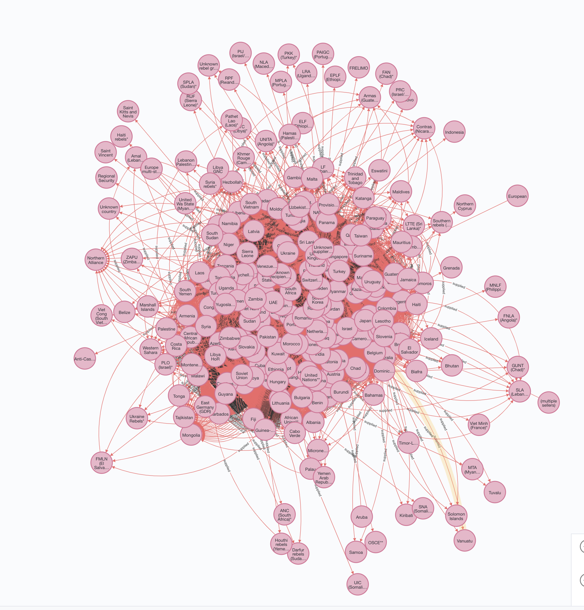
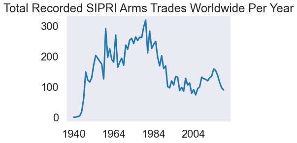
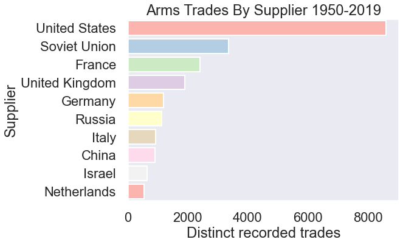
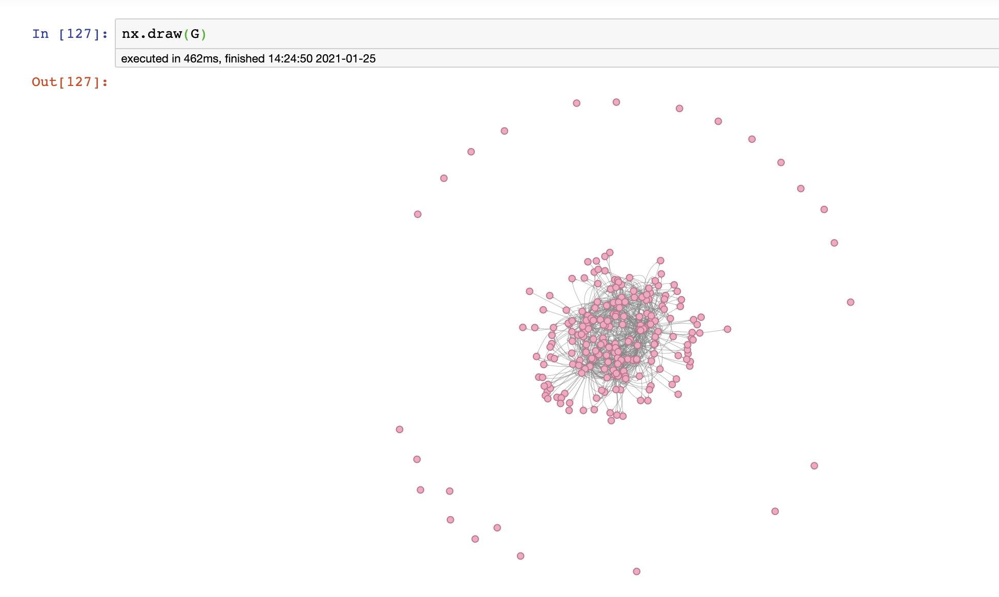

# _Lords of War: A Global Arms Trade Analysis_

# Introduction & Goals

- This project uses data from [SIPRI's Arms Trade Database](https://www.sipri.org/databases/armstransfers) and is a work in progress currently focusing on network analysis using Neo4j and Python of the highly interconnected relationships and flow of goods between actors in the arms trade.
  - Utilizing data broken down by Supplier and Recipient that I have cleaned extensively for examination and visualization.
  - Used Python's pandas library for large amounts of data cleaning, seaborn library for data visualization during analysis, and Neo4j for graph database storage of highly interrelated trade data.
- Current goal is Exploratory Data Analysis and generally uncovering information about the data. Next steps include clustering, outlier detection, further NLP on the text columns, and more.

# Contents

- [The Data Set](#the-data-set)
- [Project Status](#project-status)
- [Follow Me On](#follow-me-on)

# The Data Set

- The dataset contains over 25k transactions between over 250 actors(_nation state and non both_) from 1940 to 2019 in the global arms trade.
- I chose this dataset after working on regime change data previously and world unrest, seeing the arms trade as a natural evolution of what to study. I hope to incorporate these projects together(the other mentioned -- [located here](https://github.com/MichaelBurak/regime_changes) -- being a stock analysis of defense stock compared to world unrest towards authoriatarianism and the fragility of states undergoing it.)
- The data is wonderfully dense and I am still exploring it and finding new things to study.
- Issues include the rich text format that the data originally was in making it difficult to import and requiring extensive data wrangling as the columns would not align and NaN predominated the dataset(so much of the notebook is data wrangling), as well as a format not suited for traditional analysis in Python's data science ecosystem.
- Additional data I'd like to add in is data on the countries themselves, possibly financial data as well, along with the unrest and state fragility datasets I have worked with in the above project.

# Project Status

This project is still in process, keep tuned for more! So far I have gained a greater appreciation for my data cleaning skills, a willingness to tackle the most arcane of datasets, and a deep interest rekindled in this sort of socio-political data.

# Follow Me On

[LinkedIn](https://www.linkedin.com/in/michael-burak/) for **pretty pictures**

